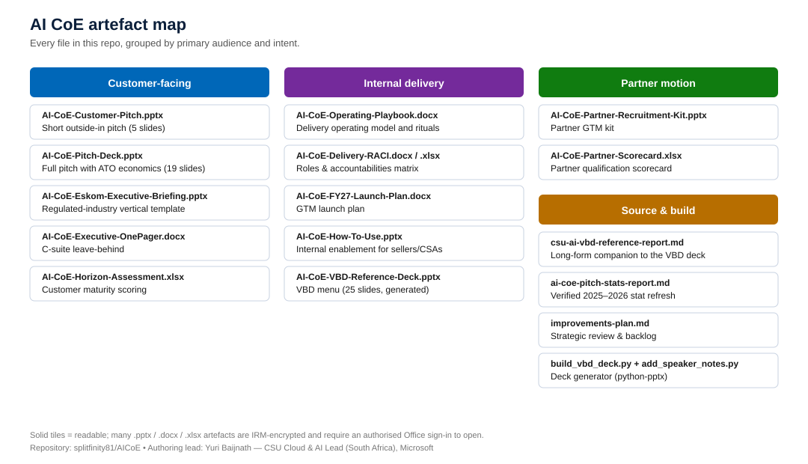
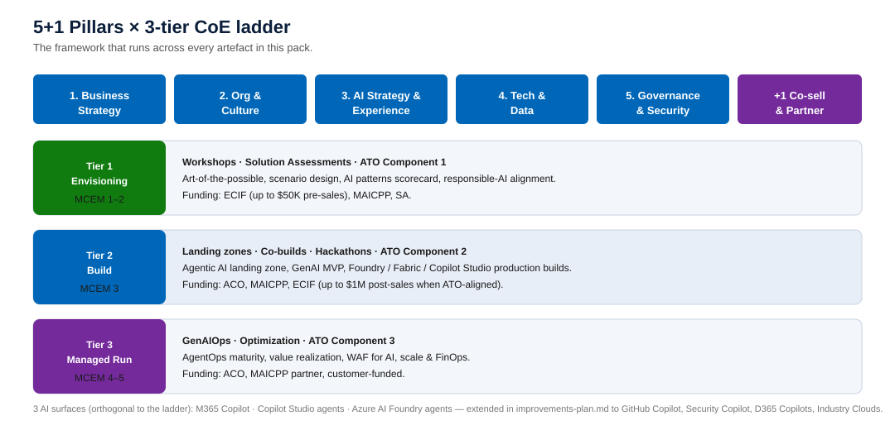

# AI Center of Excellence (AI CoE) — Offer Pack

> A consolidated set of customer-facing, internal delivery, and partner-motion artefacts for the **Microsoft RSA AI Center of Excellence** offer, plus the long-form Markdown reports and Python builders that produce them.

This repository is the working source of truth for the AI CoE offer used by the **Cloud & AI Platforms CSU (RSA)** to land, build, and run AI transformations with customers and partners. It bundles pitch material, the Operating Playbook, RACI, partner kit, and a CSU-wide VBD reference catalogue that maps every AI Value-Based Delivery (VBD) to its outcome, MCEM stage, funding instrument, and CoE-ladder tier.

---

## At a glance



The pack is organised into four lanes:

| Lane | Audience | Use it for |
|---|---|---|
| **Customer-facing** | C-suite, BDMs, ITDMs at the customer | Pitches, executive briefings, leave-behinds, maturity scoring |
| **Internal delivery** | RSA CSU, STU, Account teams | Operating model, RACI, FY launch plan, seller enablement |
| **Partner motion** | MAICPP / SI partners | Partner recruitment, qualification scoring |
| **Source & build** | Authors and reviewers | Long-form reports, stat refresh, deck-generation scripts |

---

## Framework

Every artefact in the pack is grounded in the same framework: the **5+1 Pillars** (the *what*) crossed with a **3-tier CoE ladder** (the *how-far*) and Microsoft's **MCEM** lifecycle (the *when*).



The offer also runs across **three AI surfaces** — M365 Copilot, Copilot Studio agents, and Azure AI Foundry agents — with the explicit ambition (see [`improvements-plan.md`](improvements-plan.md)) to extend coverage to **GitHub Copilot, Security Copilot, D365 Copilots, Intune Copilot, Industry Clouds, and Microsoft Fabric**.

---

## Repository contents

### Customer-facing decks and documents

| File | Format | Description |
|---|---|---|
| [`AI-CoE-Customer-Pitch.pptx`](AI-CoE-Customer-Pitch.pptx) | PowerPoint (5 slides) | Short outside-in pitch for first customer meetings |
| [`AI-CoE-Pitch-Deck.pptx`](AI-CoE-Pitch-Deck.pptx) | PowerPoint (19 slides) | Full pitch — 5+1 Pillars, F1–F10 factory, ATO economics, $1:$3–5 value, KPI scaffold, NTT DATA & Capgemini proof points |
| [`AI-CoE-Eskom-Executive-Briefing.pptx`](AI-CoE-Eskom-Executive-Briefing.pptx) | PowerPoint (9 slides) | Regulated-industry vertical template (POPIA / PFMA / NERSA, SA North/West residency, Purview AI Hub) |
| [`AI-CoE-Executive-OnePager.docx`](AI-CoE-Executive-OnePager.docx) | Word | C-suite leave-behind summarising the offer in one page |
| [`AI-CoE-Horizon-Assessment.xlsx`](AI-CoE-Horizon-Assessment.xlsx) | Excel | Customer maturity / horizon scoring instrument |

### Internal delivery artefacts

| File | Format | Description |
|---|---|---|
| [`AI-CoE-Operating-Playbook.docx`](AI-CoE-Operating-Playbook.docx) | Word | The CoE's delivery operating model, rituals, gates, and governance |
| [`AI-CoE-Delivery-RACI.docx`](AI-CoE-Delivery-RACI.docx) / [`.xlsx`](AI-CoE-Delivery-RACI.xlsx) | Word + Excel | Roles & accountabilities matrix across CSU / STU / ATU / partner |
| [`AI-CoE-FY27-Launch-Plan.docx`](AI-CoE-FY27-Launch-Plan.docx) | Word | FY27 GTM launch plan |
| [`AI-CoE-How-To-Use.pptx`](AI-CoE-How-To-Use.pptx) | PowerPoint | Internal enablement deck for sellers and CSAs — how to use this pack |
| [`AI-CoE-VBD-Reference-Deck.pptx`](AI-CoE-VBD-Reference-Deck.pptx) | PowerPoint (25 slides) | The CSU-wide AI VBD menu — generated from `csu-ai-vbd-reference-report.md` via `build_vbd_deck.py` |

### Partner motion

| File | Format | Description |
|---|---|---|
| [`AI-CoE-Partner-Recruitment-Kit.pptx`](AI-CoE-Partner-Recruitment-Kit.pptx) | PowerPoint | Partner GTM and recruitment kit |
| [`AI-CoE-Partner-Scorecard.xlsx`](AI-CoE-Partner-Scorecard.xlsx) | Excel | Partner qualification and scoring tool |

### Source reports and builders

| File | Description |
|---|---|
| [`csu-ai-vbd-reference-report.md`](csu-ai-vbd-reference-report.md) | Long-form CSU AI / AI CoE VBD Reference Appendix — every CSU-deliverable AI VBD with owner, scope, MCEM stage, funding instrument, 5+1 pillar, and CoE-ladder tier. **Source of truth for the VBD deck.** |
| [`ai-coe-pitch-stats-report.md`](ai-coe-pitch-stats-report.md) | Verified 2025–2026 stat refresh — every replacement statistic for the pitch pack, sourced directly from Deloitte, BCG, and McKinsey publisher pages |
| [`improvements-plan.md`](improvements-plan.md) | Strategic review of the entire pack with 14 prioritised improvement themes |
| [`build_vbd_deck.py`](build_vbd_deck.py) | Python (`python-pptx`) generator that builds `AI-CoE-VBD-Reference-Deck.pptx` from the VBD reference report |
| [`add_speaker_notes.py`](add_speaker_notes.py) | Adds per-slide speaker notes to the generated VBD deck (additive only — preserves shapes and order) |

---

## How to use this pack by role

| If you are… | Start with… | Then read… |
|---|---|---|
| **An account team preparing a first customer meeting** | `AI-CoE-Customer-Pitch.pptx` | `AI-CoE-Executive-OnePager.docx`, `AI-CoE-Horizon-Assessment.xlsx` |
| **A CSA / CSAM scoping a delivery** | `AI-CoE-VBD-Reference-Deck.pptx` + `csu-ai-vbd-reference-report.md` | `AI-CoE-Operating-Playbook.docx`, `AI-CoE-Delivery-RACI.xlsx` |
| **An exec sponsor briefing a regulated customer** | `AI-CoE-Eskom-Executive-Briefing.pptx` | `AI-CoE-Pitch-Deck.pptx` (slides on governance, ATO, KPIs) |
| **A partner manager onboarding an SI** | `AI-CoE-Partner-Recruitment-Kit.pptx` | `AI-CoE-Partner-Scorecard.xlsx` |
| **A reviewer of the offer itself** | `improvements-plan.md` | `ai-coe-pitch-stats-report.md` |
| **A new joiner to the CoE** | `AI-CoE-How-To-Use.pptx` | This README, then `AI-CoE-Operating-Playbook.docx` |

---

## Building the VBD reference deck

The VBD deck is generated, not hand-edited. To rebuild it from the Markdown source:

```bash
# Requires Python 3.9+
pip install python-pptx

# 1. Generate the deck from csu-ai-vbd-reference-report.md
python build_vbd_deck.py

# 2. Add speaker notes to every slide (additive — preserves shapes and order)
python add_speaker_notes.py
```

The output is `AI-CoE-VBD-Reference-Deck.pptx` (25 slides at the time of writing). The deck's visual theme is aligned to the `AI-CoE-Pitch-Deck` style canon (Microsoft blue `#0067B8`, Azure cyan `#50E6FF`, Copilot purple `#742A9B`).

---

## A note on protected files

Most `.pptx`, `.docx`, and `.xlsx` artefacts in this repository are protected by **Microsoft Information Protection / Azure RMS** sensitivity labels. Opening or editing them requires signing in to Office with an authorised Microsoft account that has been granted rights to the label. Programmatic extraction is intentionally not possible. The two readable text-based sources are:

- `csu-ai-vbd-reference-report.md` — long-form companion to the VBD deck
- `ai-coe-pitch-stats-report.md` — verified stat refresh

Together with `improvements-plan.md`, these three Markdown files contain the offer's strategic core in plain text and are safe to read, review, and reuse without label authorisation.

---

## Authoring

**Lead:** Yuri Baijnath — Senior CSA Manager, RSA CSU, Microsoft South Africa.
**Audience:** RSA CSU (CSAs, CSAMs, STU, ATU) and the partner ecosystem delivering the AI CoE offer.
**Cadence:** The VBD catalogue refreshes each fiscal year — re-verify on the MCAPS Catalog before any customer commit. Items flagged `VERIFY` in `csu-ai-vbd-reference-report.md` should be cross-checked on MCAPS Catalog / Microsoft Partner Center / `aka.ms` VBD index before being quoted in customer-facing material.
